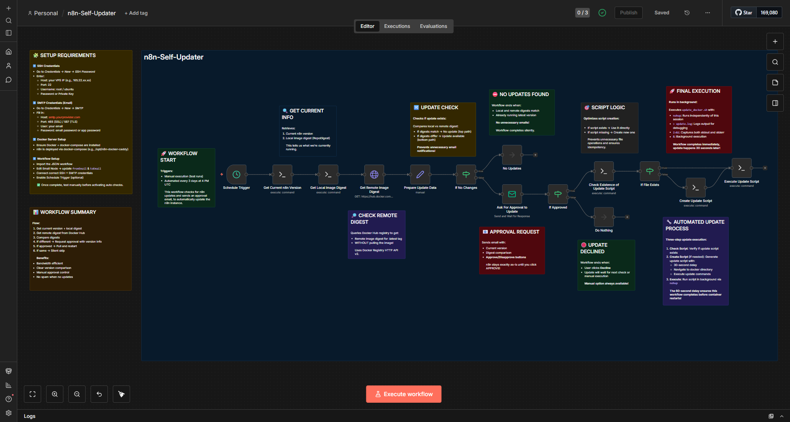

# n8n Self-Updater Workflow

> An automated **n8n workflow** originally built for **DigitalOcean-based n8n deployments**, but fully compatible with **any VPS or cloud hosting** (e.g., AWS, Google Cloud, Hetzner, Linode, etc.) where n8n runs via Docker.


This workflow checks for the latest Docker image of n8n, notifies you via email for approval, and securely updates your n8n instance via SSH once approved.



---

## How It Works

1. **Trigger**: The workflow runs automatically every 3 days at 4 PM UTC (or manually if triggered).
2. **Check Version**: It retrieves your current n8n Docker version and image digest via SSH.
3. **Compare**: Fetches the remote digest from Docker Hub and compares it with the local one.
4. **Notify via Email**: If a new update is available, an approval email is sent with details:

   * Current version
   * Local digest
   * Remote digest
   * What will happen after approval
5. **Approval Logic**:

   * **Approve** → Workflow connects via SSH and updates the n8n container automatically.
   * **Decline** → Workflow ends; next check occurs in the next cycle.
6. **Auto Update Execution**:

   * Creates (if missing) a `update_docker.sh` script on the server.
   * Runs it in the background (`nohup`) to:

     ```bash
     cd /opt/n8n-docker-caddy
     docker compose pull
     docker compose down
     docker compose up -d
     ```
   * The delay ensures n8n restarts only after workflow completion.

---

## Requirements

* **SSH Access** to your server (where n8n runs).

  * Add your credentials in n8n under *Credentials → SSH Password*.
* **SMTP Connection** for email notifications.

  * Configure in *Credentials → SMTP*.
  * Fill in:

    * **From Email** → e.g., `info@yourdomain.com`
    * **To Email** → your email for receiving approvals
* **Docker-based n8n Deployment**, e.g., `n8n-docker-caddy` setup.
* **Docker and docker-compose** installed on the server.

---

## How to Use

1. **Import the Workflow**:

   * Copy the provided JSON file.
   * In your n8n instance → click **Import Workflow** → paste the JSON.

2. **Set Up Credentials**:

   * Create two credentials in n8n:

     * `SSH Password` → Your server's SSH credentials.
     * `SMTP` → Your email provider's SMTP credentials.

3. **Edit the Email Node**:

   * Replace:

     * `fromEmail`: `info@yourdomain.com` → with your email.
     * `toEmail`: `youremail@yourdomain.com` → with your desired recipient.

4. **Enable Auto Trigger** (optional):

   * Go to the **Schedule Trigger** node and set your desired interval/time.

5. **Run the Workflow**:

   * Test manually first.
   * Once verified, activate it for automatic checks.

---

## Notes

* Originally designed for **DigitalOcean VPS setups**, but can run on **any Docker-based n8n server**.
* The workflow avoids duplicate updates by comparing digests instead of version tags.
* If the `update_docker.sh` file already exists, it reuses it safely.
* Approval emails include full details for transparency.
* Background execution ensures no interruptions during restart.

---

## Example Behavior

* **Day 1**: Workflow checks → detects update → sends email → user approves.
* **30 seconds later**: Workflow runs update script → n8n restarts with latest Docker image.
* **Day 4**: Workflow checks again → digests match → silently completes (no email sent).

---

**Author:** Muhammad Anas Farooq
